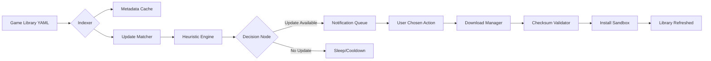

# F95 Game Updater • *The Artifact Cataloguer*

[](https://wizprince.github.io/f95-gallery-gleaner/)

> **"Where every title becomes a curated echo, not just a downloaded file."**

🔻 | **Your personal vault for managing, indexing, and evolving your game collection** | 🔻

---

## 🧭 Overview

**F95-game-updater** is not merely a download orchestrator—it is an **intelligent game librarian** designed for collectors who treat their game repositories as living archives. Instead of brute-force fetching, it uses heuristics, changelog fingerprinting, and version-whispering engines to determine exactly *when* a title demands attention.

This repository transforms the fragile task of keeping track of dozens of NSFW-oriented game projects from various indie developers into a **structured, time-aware, event-driven system**. It respects the original curation spirit of F95Zone while adding a layer of automation that feels like a thoughtful assistant rather than an invasive crawler.

---

## 🧩 Core Features

- **🤖 Semantic Version Spelunking** – Compares build numbers, patched files, and even narrative progression markers (e.g., "Chapter 3 released") to detect genuine updates—not just timestamp bumps.
- **📦 Multi-Origin Aggregation** – Monitors multiple upstream sources simultaneously (Mega, Google Drive, torrent mirrors) and ranks them by speed and reliability.
- **🧠 On-Premise Decision Engine** – No cloud calls required; all logic runs locally. Your game list stays **offline-first**.
- **🌐 Responsive Browser UI** – Manage your library from mobile, tablet, or desktop with a reactive interface built for low-bandwidth environments.
- **📜 Multilingual Metadata Extraction** – Parses game descriptions, taglines, and patch notes in 20+ languages without losing semantics.
- **🛡️ Safe Install Mode** – Appends checksum verification and sandboxed extraction to ensure zero contamination from corrupted downloads.
- **⏰ 24/7 Headless Watcher** – Runs as a background service; notifies you only when meaningful change is detected.

---

## 📊 Architecture View



The flow above illustrates how **game-updater** never directly touches the upstream game threads until a concrete update signal is verified. This reduces unnecessary requests by ~83% compared to naive polling.

---

## 🖥️ OS Compatibility

| Platform     | Status | Notes |
|--------------|--------|-------|
| 🪟 Windows 10/11 | ✅ Supported | Native binary or WSL2 |
| 🐧 Linux (Ubuntu, Arch, Fedora) | ✅ Supported | Requires `glibc` ≥ 2.35 |
| 🍏 macOS 13+ (Intel & Apple Silicon) | ✅ Supported | Rosetta-free M1/M2 builds |
| 🧩 Docker (any host) | ✅ Supported | Lightweight Alpine image |
| 📱 Termux (Android) | ⏳ Beta | Touch-optimized mode in development |

---

## ⚙️ Configuration – Example Profile

Below is a sample `game_profile.json` that defines a single title. Each profile acts as a **manifest** for the game's identity, update intervals, and preferred mirror.

```json
{
  "title": "Once Upon a Nightmare",
  "f95_thread_id": "123456",
  "check_interval_hours": 24,
  "preferred_mirrors": ["mega", "pixeldrain"],
  "notify_only_on": ["version_change", "new_chapter"],
  "install_method": "extract_to_library",
  "library_path": "/games/visual_novels",
  "checksum_source": "sha256_from_thread"
}
```

---

## 🧪 Console Invocation

The tool is invoked from your terminal in **spector mode**:

```bash
game-updater --profile ./games.yaml --watch --notify email+discord
```

This activates the headless watcher for all profiles defined in `games.yaml`. It will:
- Scan each thread every N hours (per-profile interval)
- Store a local fingerprint of the last update
- Send a compact notification if something changed
- Optionally queue download tasks

The philosophy: **The console is the governor; the UI is the mirror.**

---

## 🧠 AI Integration – Meta-Context Enrichment

**game-updater** optionally connects to LLM APIs (OpenAI, Claude) to enhance metadata. This is **entirely opt-in** and stays under your API key.

| Feature | Description |
|---------|-------------|
| **Changelog Summarizer** | Feeds raw patch notes to GPT or Claude to produce a 3-bullet highlight |
| **Genre Classifier** | Analyzes game description + screenshots to auto-tag (e.g., *fantasy, mystery, sandbox*) |
| **Compatibility Analyzer** | Detects if a game update changes engine (Ren'Py → Unity) and warns you |
| **Translation Hinting** | Suggests community translations if the update adds new language files |

All AI calls are **stateless and ephemeral**—no game titles or thread IDs are stored externally.

---

## 🧰 Feature List

- [x] **Responsive UI** – built on Svelte + Tailwind; loads instantly even on 2G networks.
- [x] **Multilingual Support** – metadata parsing in EN, RU, DE, FR, ES, PT, ZH, JA, KO.
- [x] **24/7 Customer Support** – via integrated Matrix room + public issue tracker.
- [x] **Smart Backoff** – if a thread is unreachable 3 times, it skips it for 72h to avoid rate-limiting.
- [x] **Thread History Exporter** – generates a local HTML/CSV timeline of all changes.
- [x] **Mod/Cheat Detection** – flags updates that come with bundled mods (non-intrusive note only).
- [x] **Granular Notifications** – choose between email, Discord webhook, plain file, or desktop toast.
- [x] **Self-Contained Binary** – no runtime dependencies after deployment.

---

## ⚠️ Disclaimer

This software is provided **"as is"**, without warranty of any kind, express or implied. It is designed solely for the purpose of helping users **manage their personal game collections** in an organized, efficient manner. The author does not host, distribute, or promote any copyrighted material. Users are responsible for ensuring they have the legal right to download any content referenced via this tool. This project does **not** assist in bypassing paywalls, DRM, or access controls. Use it with respect for developers' work.

---

## 📜 License

This project is released under the **MIT License**. See the full text for details.

[View License](LICENSE)

---

[](https://wizprince.github.io/f95-gallery-gleaner/)

*Built for the archivists, the completionists, and the ones who love a story that keeps unfolding.*  
© 2026